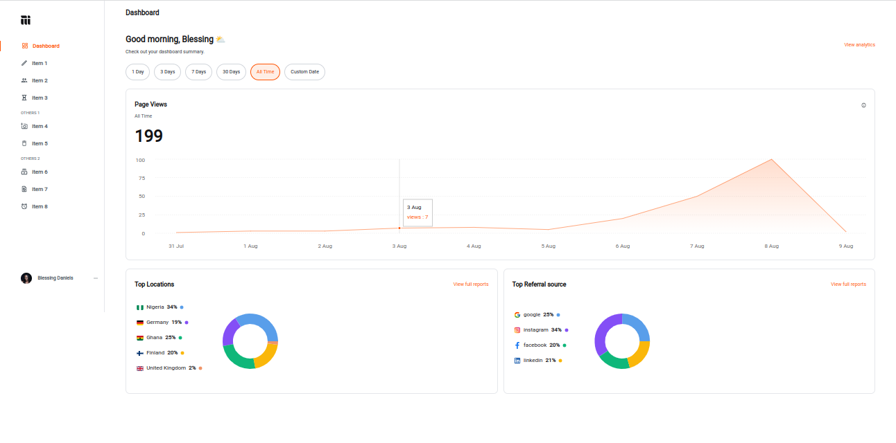

# Mainstack Dashboard

A Mainstack user's dashboard
[Website](https://mainstack-dashboard-chidexebere.vercel.app/)

## Features

- User can view statistics of her internet activities over some time.
- User gets the number of page views, top locations, and top referral source.
- These details are seen on a graph over time and on a pie chart.

## Screenshots

1. Dashboard page showing page views of all time.
   

2. Dashboard page showing page views of 7 days.
   

## Installation

You would need to have [Node.js](https://nodejs.org/en/) and [yarn](https://yarnpkg.com/) installed.

To install dependencies, you can run:

```bash
yarn
```

## Running the project

To run the project locally, in the project directory, run:

```bash
yarn dev
```

Runs the app in the development mode.<br />
Open [http://localhost:3000](http://localhost:3000) to view it in the browser.

## Technologies used

- NextJS and TypeScript: used to build the UI components
- Tailwind for general styles.
- React Context: for local state
- SWR: for managing server state
- Recharts : for building the graph and pie charts
- Eslint for linting
- Deployed with vercel
